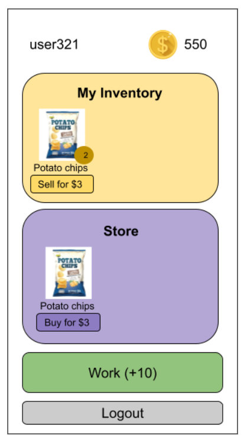
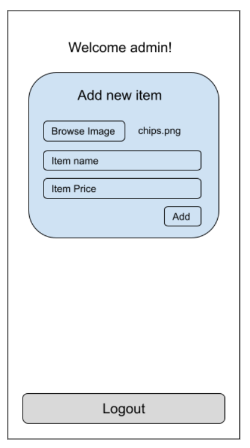
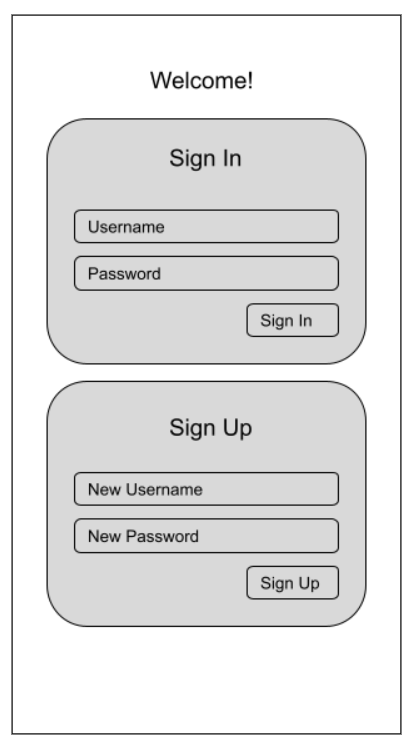
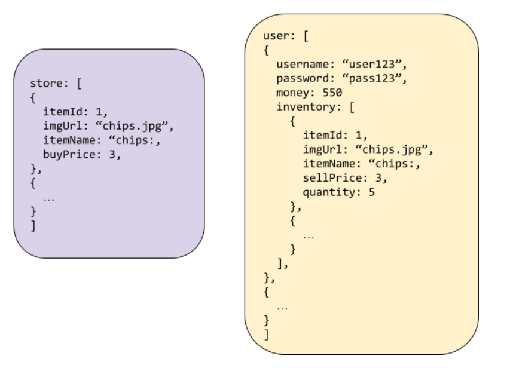
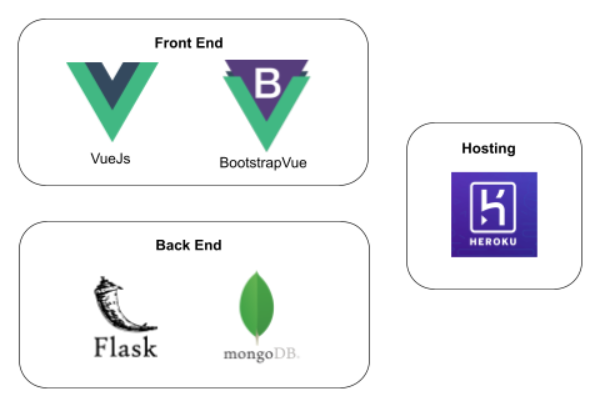
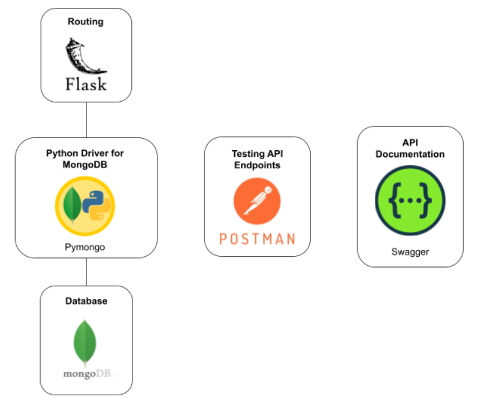

# Money Game

## Purpose of this game

The purpose of this simple game is to allow me to get familiar with api development and NoSQL database design.

## How the game works

Upon signing in to the game, users can press a button labelled `Work` to earn coins. Users can then use the coins they have earned to buy things from a store. Upon buying an item from the store, the item will be added into the user's inventory, where they can choose to sell the item for coins. 

The original motivation behind this game was crypto/NFT related. However, I wanted to keep the game as simple as possible so that I can focus on learning backend programming.

**Frontend mock ups:**

Note: This app was only designed to be used on mobile, not on desktop.

<p align="center">
  
  
  
</p>

**Database Schema:**
* **Authentication:** unique username and password to signin
* **Money**
* **Inventory:** itemid, picture, quantity, sell price
* **Store:** itemid, picture, buy price

<p align="center">
  
</p>

**Abstract backend API used by normal users:**

- [x] `/user`: POST method that takes unique username, password, and creates a user in the database, returns userId
- [x] `/user`: POST method that username, password, returns userId
- [x] `/money`: POST/UPDATE method that takes userId, and updated money
- [x] `/inventory`: GET method that gets all items in inventory
- [x] `/store`: GET method that gets all items in store
- [x] `/buyItem`: POST/UPDATE method -> decrement money; if item in inventory, increment quantity by 1; else, add item;
- [ ] `/sellItem`: POST/UPDATE method -> decrement quantity; increment money

**Abstract backend API used by admin:**
- [x] `/user`: POST method that username, password, returns userId of admin
- [x] `/store`: GET method that gets all items in store
- [x] `/storeItem`: POST method that uploads new item to store (picture, name, price, auto snag id)
- [x] `/storeItem` : DELETE method that deletes an item from store

**Backend features:**
- hashed passwords
- enforce unique usernames

## Vue Project setup
**Install dependencies:** `npm install`

**Compiles and hot-reloads for development:** `npm run serve`

**Compiles and minifies for production:** `npm run build`

**Lints and fixes files:** `npm run lint`

**Customize configuration:** See [Configuration Reference](https://cli.vuejs.org/config/).

## API Project setup
All sequences of commands are assumed to be run from the root directory.

**Activating python virtual environment:** 
```
cd api/Scripts
activate
```

**Install dependencies:** 
```
cd api
pip install -r requirements.txt
```

**Run server:** 
```
cd api/routes
python app.py
```

## Infrastructure
**Technological Stack:**
<p align="center">
  
</p>

**Backend Infrastructure:**
<p align="center">
  
</p>

**Additional Libraries/Packages used:**
* [Vue 3D Carousel](https://github.com/wlada/vue-carousel-3d)
* [PyJWT](https://pyjwt.readthedocs.io/en/stable/usage.html)

**References:**
* [Handling file uploads in Vue](https://www.digitalocean.com/community/tutorials/how-to-handle-file-uploads-in-vue-2)
* [Flask and MongoDB tutorial](https://www.youtube.com/watch?v=o8jK5enu4L4)
* [API Development Course](https://www.youtube.com/watch?v=0sOvCWFmrtA)
* [Sending image files from backend to frontend](https://stackoverflow.com/questions/33279153/rest-api-file-ie-images-processing-best-practices)
* [base64 encode in python and decode in javascript](https://stackoverflow.com/questions/35443332/base64-encode-in-python-decode-in-javascript)
* [render base64 image in vue](https://stackoverflow.com/questions/46492356/render-base64-image-in-vue-js)

## Reflections and Key Takeaways

### Glossary
| Label      | Meaning |
| ----------- | ----------- |
| Best Practice | Coding best practices, or good design principles I have learnt       |
| Read up   | Topics I have read up about through the course of working on this project  |
| School   | Concepts I have learnt in school that I managed to apply in this project |
| Technical  | Low level technical details that I have learnt |
| Concept   | General concepts that I have learnt |
| Design Decision   | Design decisions that I have made in the course of this project |
| Security Concern   | Security related considerations/discussions |

**Best practice: Use the resource name as the api route name**

Eg. For a route that creates a new user in the database, use the route `/user` instead of `/createUser`.

**Best practice: For POST or DELETE methods, return the object created or deleted in the response**

This is to make it easier for frontend people to debug.

**School: API discovery does help me to structure my work better**

Looking at the high level features of the application and coming up with high level abstract APIs does indeed help me organize my work. This is because I can follow the abstract APIs to implement my concrete RESTful APIs. This gives me time and energy to focus on writing good API and adhering to good design principles, without having to worry about whether I'm missing any important features.

**Technical: `.env` file to store sensitive information such as private keys**

I knew it was unsafe to put private keys and sensitive information on a git repository, so I looked for a way to store that information without commiting it directly to Github. I found that it was common practice to use a `.env` file for this purpose.

**Technical: `requirements.txt` file to make it easier for other developers to install project dependencies**

When I was installing dependencies for the project, I wondered how I would have to repeat this process of installing the dependencies one by one again if I were to set up this project again. I looked online for a solution, and found that people often used this `requirements.txt` file to solve this issue.

**Best Practice: Use of virtual environment**

I chose to use a python virtual environment for the API section of this project to prevent the packages/libraries installed in this project to affect the packages/libraries used in other projects on my computer. This is a best practice when working with Python based projects especially.

**Concept: REST APIs**

stands for **Representational State Transfer**
* **Client-server architecture:** and communicate through HTTP
* **Stateless communication:** each request is independent of one another
* **Cacheable data:** Make data cacheable by including expiry time in response, or which data should not be cached. This is so that we can help to increase efficiency in our application.
* **Uniform interface:** Allow standardized means of communicating between server and client, usually using HTTP with URI resources, CRUD, and JSON. (This is to decouple client from server).
* **Layered system:** separates the different types of servers (eg. one for security, one for load balancing etc) 
* **Code on demand:** ?

**Technical: Caching for frontend** 

In my previous projects, I have come to realise that my websites have low performance (high latency) and I think that this is because I didn't do any caching on the frontend. Hence I want to do frontend caching for this project to increase performance.

**Read up: Load balancing**

Load balancing is for distributing network traffic across multiple backend servers. I guess this is for larger websites that scale up enough to require multiple backend servers. But right now I don't think this is very applicable to my application. (Maybe this is done during deployment? The place I deploy my server to will do load balancing?)

**Technical: base64 encoding**

base64 is a binary to text encoding scheme that represents binary data. `64` comes from the `radix-64 representation`. Binary to text encoding schemes are designed to carry data stored in binary formats across channels that only reliably support text content. In my project, I used base64 encoding to convert image files into text so that they can be passed from backend to frontend in JSON format.

**Read up: Middleware in node.js VS Decorators in flask**

It's like a middleman between 2 software applications, and provides services to them beyond those available from OS. 

Middleware functions have access to request, response and next function in request-response cycle. Middleware function is like the functions we define after the routes in flask (Except its in nodejs).

Middleware classes in flask seem to be a different thing. Flask middleware is a WSGI middleware which operates by wrapping the Flask application instance.

Use route decorators in flask instead. route decorators decorate a view function to register it with the given url rule and options.

**Read up: Web Server Gateway Interface (WSGI)**

Used to forward requests from a web server (such as Apache or nginx) to a backend python web application or framework.

**Technical: Binary large object (blob)**

It is a collection of binary data stored as a single entity, usually is images, audio, or binary code. 

**Technical: Cross Origin Resource Sharing (CORS)**
A HTTP header mechanism that allows a server to indicate which origins other than its own that a browser can load resources from. Browsers usually make a preflight request to the server to check that the server will permit the request.

**Security concern: Exposing mongodb object id in url query**

Originally, I was concerned with exposing the mongodb object id in url query (when building endpoint for deleting store items), but upon some reading, I found that the object id is based upon the time of creation of the document, hence the information is not sensitive. Also, [someone on quora](https://www.quora.com/What-if-any-are-the-security-risks-associated-with-exposing-a-MongoID-string-in-a-URL) mentioned that trying to hide the object id is a kind of "security through obscurity" practice, which we should not be depending on. We should instead focus on access control to the database.

**Best Practice: MongoDB Schema Design**
- For relational, focus on: Don't duplicate data
- For NoSQL, no rules, no process, no algorithm, consider how to store data and query performance. (Focus on designing a schema uniquely suited to your application)
- Embedding vs Referencing. Embedding is storing object within another object (same as join)
  - Pros of embedding: retrieve all data in a single query, can avoid expensive joins and can update all data with a single atomic operation.
  - Cons of embedding: large docs means more overhead, if you dont need all data at once, dont embed. 16MB document size limit
  - Pros of referencing: smaller docs, less likely to reach 16mb limit, no duplication of data, infrequently accessed data not accessed on every query
  - Cons of referencing: More queries required to retrieve all data
- Favor embedding unless there is a compelling reason not to. (Needing to access an object on its own is a compelling reason not to embed it)
- Avoid joins (embedding?)
- Arrays should not grow without bound
- One to one: Use key value pairs
- One to few: Prefer embedding
- One to many: Prefer referencing
- One to squillions: Prefer referencing

**Design Decision: Embedding for inventory items**

After learning about best practices for MongoDB Schema design, I decided to use embedding for inventory items.

Pros:
- Can retrieve all data in a single query
- Shouldnt have too many items in the inventory
- We wont have to retrieve items 1 by 1 so there is not much incentive to use referencing.

Cons: 
- might exceed 16MB document limit (especially since we are storing images inside the JSON too)
  - 0.2KB for a document with imgUrl
  - about 50KB for a document with base64Img, depends on size of image I think
  - Can get around this by compressing the image before storing

**Design Decision: Schema Validation on server side**

Upon some reading, I decided not to focus too much on schema validation on the server side for this project. This is because input validation will already be done on the client side for user experience purposes and the client side will be sending the correct data to the API. I am able to do this since this is a small project and I am the only developer involved. However, if there were separate people working on the frontend and backend, I would definitely prioritize schema validation on server side more.

**Security concern: Storing passwords in plaintext**

Storing passwords in plaintext is really bad and violates our users privacy as anyone who has access to the database can see the passwords. Hence, we have to hash the passwords before storing it into our database. I chose to use the passlib library which has no known weaknesses at the time of writing. (Use `.verify()` method instead of `==` to compare whether password matches to prevent timing attacks)

**Best Practice: Use of Blueprints to modularize backend code**

[Useful explanation of blueprints](https://realpython.com/flask-blueprint/)

**Technical: Using JWT token for authentication**

When someone logs in successfully, server will sign a jwt token and send it to the client. Client can then send that jwt token together with requests so that they can get access to routes that require authentication. Server will verify that token is valid, then send data/resources back.

A jwt token is actually made of header, payload and secret. Payload is somewhat of a hash of certain info we put in, eg user id, admin role etc... and then it is signed with a secret key that only the server should know. Signature prevents tampering because when attacker changes role, signature will no longer match, and they need the secret key in order to sign it properly.

The reason why we need JWT tokens is to prevent us from having to collect username and password every time someone wants to request for a resource. We work around it by using a session id. but session id doesnt scale because if we have multiple servers behind a load balancer, the different servers wont know what session ids other servers issued.

[Good explanation about JWT tokens](https://medium.com/swlh/why-do-we-need-the-json-web-token-jwt-in-the-modern-web-8490a7284482)

**Best practice: Never store jwt tokens inside localStorage of browser**

This is because localStorage or sessionStorage is accessible by any script inside your page, so a XSS attack can give a hacker access to your token, and compromise authenticity. Instead, store it in a httpOnly cookie, which is a special kind of cookie that is only sent in http reqests to the server, and it is **never accessible** from javascript running in the browser.

[JWT best practices](https://blog.logrocket.com/jwt-authentication-best-practices/)

**Technical: Cookies**

A cookie is a piece of data that your web server can set, that will be then stored by the user's web browser and sent back to the server on any future requests that browser makes to the same server as long as the cookie is valid and applicable to the request being made. Cookies are a **state management** mechanism for HTTP.

Need to use a HTTP proxy also because since we are now sending the token in a cookie, we need to run the 2 apps on the same port. (because cookies can only go to origins from which they came)

[Cookie explanation](https://stackoverflow.com/questions/39810741/how-to-store-a-jwt-token-inside-an-http-only-cookie)
[Cookie implementation](https://medium.com/@ryanchenkie_40935/react-authentication-how-to-store-jwt-in-a-cookie-346519310e81)
[Set up HTTP Proxy for Vue](https://medium.com/bb-tutorials-and-thoughts/vue-js-how-to-proxy-to-backend-server-a562bad965eb)

**Technical: Babel**

Babel is a JavaScript compiler. Babel is a toolchain that is mainly used to convert ECMAScript 2015+ code into a backwards compatible version of JavaScript in current and older browsers or environments. Here are the main things Babel can do for you:
- Transform syntax
- Polyfill features that are missing in your target environment (through a third-party polyfill such as core-js)
- Source code transformations (codemods)

[Source](https://babeljs.io/docs/en/#babel-is-a-javascript-compiler)

**Technical: OAuth2.0**

