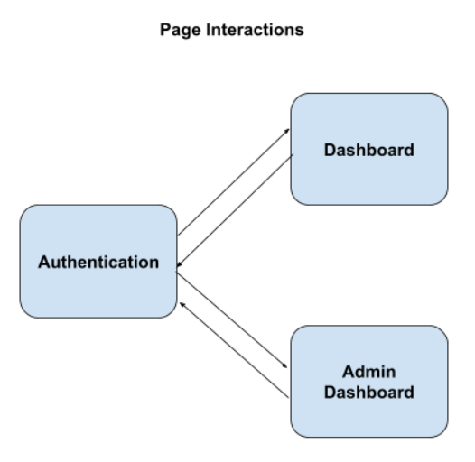
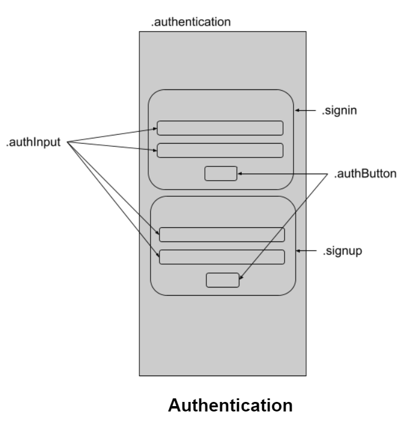

# Money Game

## Purpose of this game

The purpose of this simple game is to allow me to get familiar with api development and NoSQL database design.

## How the game works

Upon signing in to the game, users can press a button labelled `Work` to earn coins. Users can then use the coins they have earned to buy things from a store. Upon buying an item from the store, the item will be added into the user's inventory, where they can choose to sell the item for coins. 

The original motivation behind this game was crypto/NFT related. However, I wanted to keep the game as simple as possible so that I can focus on learning backend programming.

## Infrastructure
**Technological Stack:**
<p align="center">
  
</p>

## Frontend
### Frontend mock ups
Note: This app was only designed to be used on mobile, not on desktop.

<p align="center">
  
  
  
</p>

### Page Interactions
This diagram shows the 3 pages of our application and what are the possible routes users can take to navigate around our application.
<p align="center">
  
</p>

### State management
To improve user experience and performance of our application, we have to manage the flow of data and manage the state of our application well. We should aim to reduce the number of unnecessary API calls made. This diagram shows the data needed in each page.
<p align="center">
  
</p>

### API Calls
To ensure that we are making only the most necessary, I have drawn out this diagram to plan which API calls to make upon each user interaction.

<p align="center">
  
</p>

I have noticed that most of the API calls are quite straight forward, and the only place I think we could optimize is by:
- Don't call `update money` endpoint upon each click of `Work` button. (either accumulate a certain number of clicks or a certain amount of time before calling API)
- Isolate the re-rendering of components to only the sections with changes
- Cache store items (the benefit of this is if someone signs in as a normal user, then sign in as admin, it will be faster for them as they dont have to fetch the store items again. But I think the benefits of this outweighs the cost of implementation and it doesn't make a lot of sense to do this optimization.)

### CSS Classes Documentation
I decided to document the layout of my CSS classes because I used to always spend a lot of time figuring out the layout of my css classes again and again. I think that documenting it like that can help me save a lot of time when styling my components.

<p align="center">
  
  
  
</p>

### Vue Project setup
**Install dependencies:** `npm install`

**Compiles and hot-reloads for development:** `npm run serve`

**Compiles and minifies for production:** `npm run build`

**Lints and fixes files:** `npm run lint`

**Customize configuration:** See [Configuration Reference](https://cli.vuejs.org/config/).

## Backend
### Database Schema:
* **Authentication:** unique username and password to signin
* **Money**
* **Inventory:** itemid, picture, quantity, sell price
* **Store:** itemid, picture, buy price

<p align="center">
  
</p>

### Abstract backend API used by normal users
- [x] `/user`: POST method that takes unique username, password, and creates a user in the database, returns userId
- [x] `/session`: POST method that takes username, password, returns userId
- [x] `/session`: GET method that uses cookie info to fetch user info
- [x] `/session`: DELETE method to sign out, to delete jwt cookie
- [x] `/money`: POST/UPDATE method that takes userId, and updated money
- [x] `/inventory`: GET method that gets all items in inventory
- [x] `/store`: GET method that gets all items in store
- [x] `/inventoryItem`: POST/UPDATE method -> buy; decrement money; if item in inventory, increment quantity by 1; else, add item;
- [x] `/inventoryItem`: POST/UPDATE method -> sell; decrement quantity; increment money

### Abstract backend API used by admin
- [x] `/user`: POST method that username, password, returns userId of admin
- [x] `/store`: GET method that gets all items in store
- [x] `/storeItem`: POST method that uploads new item to store (picture, name, price, auto snag id)
- [x] `/storeItem` : DELETE method that deletes an item from store

### Backend features
- hashed passwords
- enforce unique usernames
- jwt authentication

### Backend Infrastructure:
<p align="center">
  
</p>

### API Project setup
All sequences of commands are assumed to be run from the root directory.

**Activating python virtual environment:** 
```
cd api/Scripts
activate
```

**Install dependencies:** 
```
cd api
pip install -r requirements.txt
```

**Run server:** 
```
cd api/routes
python app.py
```

## References 
### Additional Libraries/Packages used
* [Vue 3D Carousel](https://github.com/wlada/vue-carousel-3d)
* [PyJWT](https://pyjwt.readthedocs.io/en/stable/usage.html)

### Information sources
* [Handling file uploads in Vue](https://www.digitalocean.com/community/tutorials/how-to-handle-file-uploads-in-vue-2)
* [Flask and MongoDB tutorial](https://www.youtube.com/watch?v=o8jK5enu4L4)
* [API Development Course](https://www.youtube.com/watch?v=0sOvCWFmrtA)
* [Sending image files from backend to frontend](https://stackoverflow.com/questions/33279153/rest-api-file-ie-images-processing-best-practices)
* [base64 encode in python and decode in javascript](https://stackoverflow.com/questions/35443332/base64-encode-in-python-decode-in-javascript)
* [render base64 image in vue](https://stackoverflow.com/questions/46492356/render-base64-image-in-vue-js)
